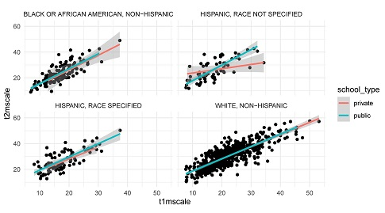

### Question 1.
Create a new R Markdown document and modify the YAML to:

* Include your name
* Change the syntax highlighting to any scheme but the default. The options are default, tango,
pygments, kate, monochrome, espresso, zenburn, haddock, and textmate. You can also use NULL if
you want no highlighting.
* Include the option to make it easy to modify the rendering between PDF and HTML.

<p style="color:red">*_Done. This is what the YAML code looks like:_*</p>  
<p style="color:red">*_title: "Lab 6"_*</p>
<p style="color:red">*_author: "Lisa Strycker"_*</p>
<p style="color:red">*_date: "October 21, 2019"_*</p>
<p style="color:red">*_output: html_document: highlight: kate_*</p>
<p style="color:red">*_pdf_document: highlight: tango._*</p>  

### Question 2.
Create a code chunk that:

* Loads all the packages you decide to use for the lab
* Sets a global chunk option to make all figures 6.5" wide and the height to a value that makes sense to you
* Does not display the code or any warnings, messages, etc. from the code, but evaluates every function/line of the code. 

<p style="color:red">*_Done. See library and knitr code below._*</p>

```{r q2}
# tinytex::instal l_tinytex()
library(here)
library(rio)
library(tinytex)
library(tidyverse)
library(janitor)
library(rmarkdown)
library(knitr)
knitr::opts_chunk$set(echo = FALSE, warning = FALSE, message = FALSE, eval = TRUE, error = FALSE, fig.width = 6.5, fig.height = 3.5)
```

### Question 3.
Import the ecls-k_samp.sav dataset (stored on Canvas in Files -> data), and produce the plot below.
Do not show the code you used (colors, themes, etc. don’t matter here). 



<p style="color:red">*_Done. See plot below. Note that the code I used is not shown._*</p>

```{r q3}
here()
eclsk <- import(here("data", "ecls-k_samp.sav"))
eclskclean <- eclsk %>% 
  clean_names()  %>%
  characterize()
View(eclskclean)

eclskclean_subset1 <- eclskclean %>%
  filter(ethnic == "HISPANIC, RACE SPECIFIED")
eclskclean_subset2 <- eclskclean %>%
  filter(ethnic == "WHITE, NON-HISPANIC")
eclskclean_subset3 <- eclskclean %>%
  filter(ethnic == "BLACK OR AFRICAN AMERICAN, NON-HISPANIC")
eclskclean_subset4 <- eclskclean %>%
  filter(ethnic == "HISPANIC, RACE NOT SPECIFIED")

eclskclean_subset <- rbind(eclskclean_subset1, eclskclean_subset2, eclskclean_subset3, eclskclean_subset4)
View(eclskclean_subset)

ggplot(eclskclean_subset, aes(x = t1mscale, y = t2mscale)) + geom_point(aes(x = t1mscale, y = t2mscale)) + geom_smooth(aes(color = school_type), method="lm") + facet_wrap(~ethnic) + theme_minimal() + theme(strip.text.x = element_text(size = 7.5))
```

### Question 4.
Run the following lines of code to store the mean and standard deviation of t1mscale.  

* t1mean <- mean(eclskclean$t1mscale, na.rm = TRUE)
* t1sd <- sd(eclskclean$t1mscale, na.rm = TRUE)

Extend this code to calculate (in the same code chunk) the mean and standard deviation of t2mscale. Using the values you calculated, use an inline code evaluation below to report the means/SDs for the two time points (t1mscale and t2mscale). Also report the difference between the means (i.e., the average gain).

<p style="color:red">*_Done. See code below._*</p>

```{r q4a, echo = TRUE}
t1mean <- round(mean(eclskclean$t1mscale, na.rm = TRUE), digits=2)
t1sd <- round(sd(eclskclean$t1mscale, na.rm = TRUE), digits=2)
t2mean <- round(mean(eclskclean$t2mscale, na.rm = TRUE), digits=2)
t2sd <- round(sd(eclskclean$t2mscale, na.rm = TRUE), digits=2)
```

<p style="color:red">*_Check mean, SD, and difference score values._*</p>

```{r q4b, echo = TRUE}
t1mean
t1sd
t2mean
t2sd
t2mean - t1mean
```

<p style="color:red">*_See sentence below with inline code._*</p>

The mean (SD) was `r t1mean` (`r t1sd`) at time 1 and `r t2mean` (`r t2sd`) at time 2. Average gain was `r t2mean - t1mean`.

### Question 5.
Pretend you are trying to teach somebody how to load data. Describe the process below that we’ve discussed in class, including why it helps reproducibility, and echo chunks of code as necessary without actually evaluating any of it.

<p style="color:red">_It helps reproducibility to load data into an R project directory so that data are always accessible, and the R code always works (and analyses can be reproduced), for anyone at any time on any computer._</p>  

<p style="color:red">_To load data:_</p>

<p style="color:red">_* Create a new R project directory._</p>

<p style="color:red">_* Within this directory create "data" and "scripts" folders._</p> 

<p style="color:red">_* Within the scripts folder, create a new R markdown file to contain all the code needed for a certain set of analyses._</p> 

<p style="color:red">_* Paste the raw data that you will be importing into the data folder._</p> 

<p style="color:red">_* Use the here() function to locate this dataset in the R markdown file._</p>  

<p style="color:red">_For instance, to import the ecls-k_samp.sav SPSS file, Use code like this (for this code, echo = TRUE but eval = FALSE so that you can see the code but it is not actually evaluated):_</p>
```{r q5a, echo = TRUE, eval = FALSE}
eclsk <- import(here("data", "ecls-k_samp.sav"))
```

<p style="color:red">_Then clean the imported data, using the characterize() code to keep value labels and the clean_names() code to fix variable names (lower case, underscores instead of spaces, etc.). Use the "View" function to see and check the imported dataset.The code looks like this (again, for this code, echo = TRUE but eval = FALSE so that you can see the code but it is not actually evaluated):_</p>

```{r q5b, echo = TRUE, eval = FALSE}
eclskclean <- eclsk %>% 
  characterize() %>%
  clean_names()
View(eclskclean)
```

<p style="color:red">_Does it work? Let's run the code and view the imported dataset. This time, echo = FALSE and eval = TRUE so that you do not see the code but the code is actually evaluated. Yes!_</p>

```{r q5c, echo = FALSE, eval = TRUE}
here()
eclsk <- import(here("data", "ecls-k_samp.sav"))
eclskclean <- eclsk %>% 
  characterize() %>%
  clean_names()
summary(eclskclean)
```
